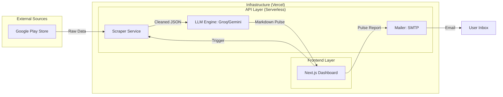

# GROWW Pulse: System Architecture & Operations

This document defines the architecture of the **GROWW Pulse** application, a dedicated UI tool for automating product sentiment analysis and stakeholder reporting.

## 1. Core Objectives
- **Automate** the extraction of 8-12 weeks of Play Store reviews.
- **Analyze** user sentiment and categorize feedback into 3-5 high-level themes using Groq LLM (Llama-3).
- **Deliver** actionable weekly reports directly to product leadership via email.
- **UI-Centric**: Provide a premium, single-click interface for non-technical users.

---

## 2. High-Level Architecture

The application is built on a "Flat Pipeline" architecture where the UI (Next.js) or Scheduler (Python) orchestrates three distinct service modules.

---

## 3. Module Specifications

### 📡 Data Ingestion (`scraper.py`)
- **Library**: Official `google-play-scraper`.
- **Package ID**: `com.nextbillion.groww`.
- **Protocol**: Batch-fetches reviews using continuation tokens to handle high volumes within specific date ranges.
- **Privacy Policy**: 
    - **PII Exclusion**: `userName` and `userImage` are explicitly discarded at the point of ingestion.
    - **Data Minimization**: Only `content`, `score`, `at`, and `thumbsUpCount` are passed to the Analysis Engine.

### 🧠 Analysis Engine (`analyzer.py`)
- **LLM**: Groq LPU™ Inference Engine (utilizing `llama-3-70b-8192`).
- **Processing Logic**:
    1. **Theme Extraction**: Analyzes a high-quality subset to define the 3-5 primary themes.
    2. **Insight Generation**: Map reviews to themes, selects 3 representative quotes, and synthesizes 3 impactful action items.
- **Prompt Engineering**: Uses a "Product Growth Expert" persona for strategic output.

### 📧 Communication Layer (`send_email.py`)
- **LLM Refinement**: Uses **Google Gemini** to generate a captivating subject line and a refined executive summary based on the analysis.
- **Protocol**: SMTP via TLS (Port 587).
- **Functionality**: Transmutes MD-formatted reports into professional email bodies. Supports dynamic recipient input from the UI.
- **Drafting**: Sends a self-addressed email that serves as a pulse draft for the user.

---

## 4. UI Design System (`app.py`)

The interface follows a **"Strategic Command"** aesthetic:
- **Font Stack**: Outfit / Inter.
- **Color Palette**: 
  - Primaries: GROWW Green (`#00d09c`), Slate (`#0f172a`).
  - Auxiliaries: Ghost White (`#f1f5f9`).
- **Interaction**: Single-page horizontal flow from Configuration (left) to Report (right).
- **Feedback**: Integrated balloons and toasts for successful analysis and email triggers.

---

## 5. Security & Environment
- **Secrets Management**: All sensitive data (API keys, SMTP passwords) are handled via `.env` files and never hardcoded.
- **Session State**: Implementation of Streamlit `session_state` to prevent data loss on UI rerenders.
- **Error Handling**: Graceful degradation if APIs (Groq/SMTP) are unreachable.
